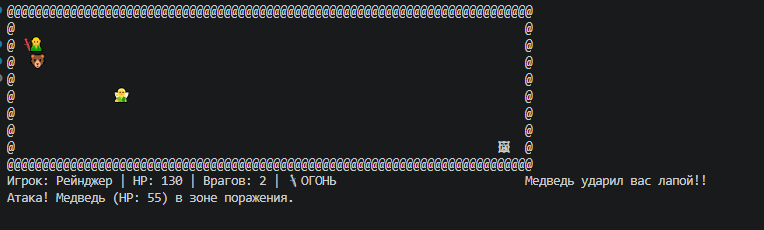

# Portal Jumper

Portal Jumper — мой учебный проект на C#. Это консольная игра, в которой главный герой исследует уровни, сражается с монстрами и ищет порталы для перехода в новые миры.  
Цель — победить 20 врагов.

## О проекте

Учебный проект на C#

## Основные механики:
- управление персонажем (W, A, S, D — перемещение героя.)
- враги с простым ИИ: фея - дальний бой, медведь - ближний бой
- система уровней через порталы (враги становятся сложнее, порталы переносят на новые уровни)
- сбор предметов / очков (зелья и яблоки для восстановления HP)

## Управление
- WASD — Перемещение
- SPACE — Атака
- F — Активировать бафф Огня
- F5 / F9 — Сохранить / Загрузить игру
- ESC — Выход

## Архитектура
- Singleton в GameManager
- Strategy разделяет логику атак (ближний/дальний бой), что делает врагов гибкими.
- State управляет поведением врагов (преследование/атака)
- Factory используется для создания врагов, что упрощает масштабирование.
- Decorator для баффов (огненный меч - F)
- Adapter для турели
- Static Config все параметры игры вынесены в отдельный класс настроек.

## Текущий статус

Версия 1.0 (Release Candidate)

## Как запустить
1. Скачайте архив игры по [этой ссылке](https://drive.google.com/file/d/1ZQtUuUcsUh5TyJ9ArSU2P3eQnw34FEw9/view?usp=sharing).
2. Скачайте архив `Game.zip`.
3. Распакуйте и запустите `Game.exe`.